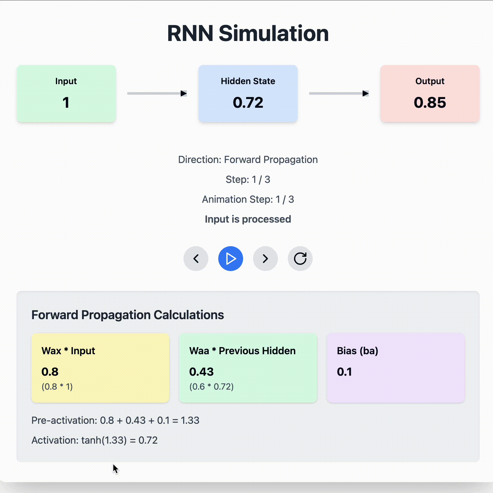

# RNN Simulation

This React component provides an interactive simulation of a Recurrent Neural Network (RNN). It's designed to help in understanding the basic concepts of RNNs, including forward propagation and backpropagation.





## Features

- Interactive step-by-step simulation of an RNN
- Visualization of data flow between input, hidden state, and output
- Detailed breakdown of hidden layer calculations for both forward propagation and backpropagation
- Controls for manual stepping, auto-play, and reset

## Installation

1. Ensure you have React and Tailwind CSS set up in your project.
2. Install the required dependencies:

```bash
npm install lucide-react
```

3. Copy the `RNNSimulation.jsx` (or `RNNSimulation.tsx` for TypeScript) file into your project.

## Usage

Import and use the component in your React application:

```jsx
import RNNSimulation from './path/to/RNNSimulation';

function App() {
  return (
    <div className="App">
      <RNNSimulation />
    </div>
  );
}

export default App;
```

## Customization

You can customize the component by modifying the following:

- Input sequence: Change the `inputSequence` array in the component.
- Weights and biases: Modify the `weights` and `biases` objects.
- Colors and styling: Adjust the Tailwind classes or add custom CSS.

## How It Works

The simulation demonstrates the following steps:

### Forward Propagation:
1. Input processing: The current input is fed into the network.
2. Hidden state update: The hidden state is updated based on the input and previous hidden state.
3. Output generation: The output is produced based on the current hidden state.

### Backpropagation:
1. Error calculation: The difference between the output and a target value is computed.
2. Gradient computation: Gradients for all weights and biases are calculated.
3. (Simulated) Weight update: The simulation shows how weights would be updated based on the gradients.

The component visualizes these steps and provides detailed calculations for both forward propagation and backpropagation.

## Detailed Calculations

### Forward Propagation
- Hidden State: h(t) = tanh(Wax * x(t) + Waa * h(t-1) + ba)
- Output: y(t) = Wya * h(t) + by

### Backpropagation
The simulation calculates the following gradients:

- dWya: Gradient for the output weight. Calculated as: dOutput * hidden_state
- dWaa: Gradient for the recurrent weight. Calculated as: dHidden_state * previous_hidden_state
- dWax: Gradient for the input weight. Calculated as: dHidden_state * input
- dba: Gradient for the hidden state bias. Equal to dHidden_state
- dby: Gradient for the output bias. Equal to dOutput

Where:
- dOutput is the gradient of the loss with respect to the output
- dHidden_state is the gradient of the loss with respect to the hidden state

These gradients show how each parameter contributes to the error and would be used to update the weights and biases in a full training process.

## Contributing

Feel free to submit issues or pull requests if you have suggestions for improvements or find any bugs.

## License

This component is released under the MIT License.